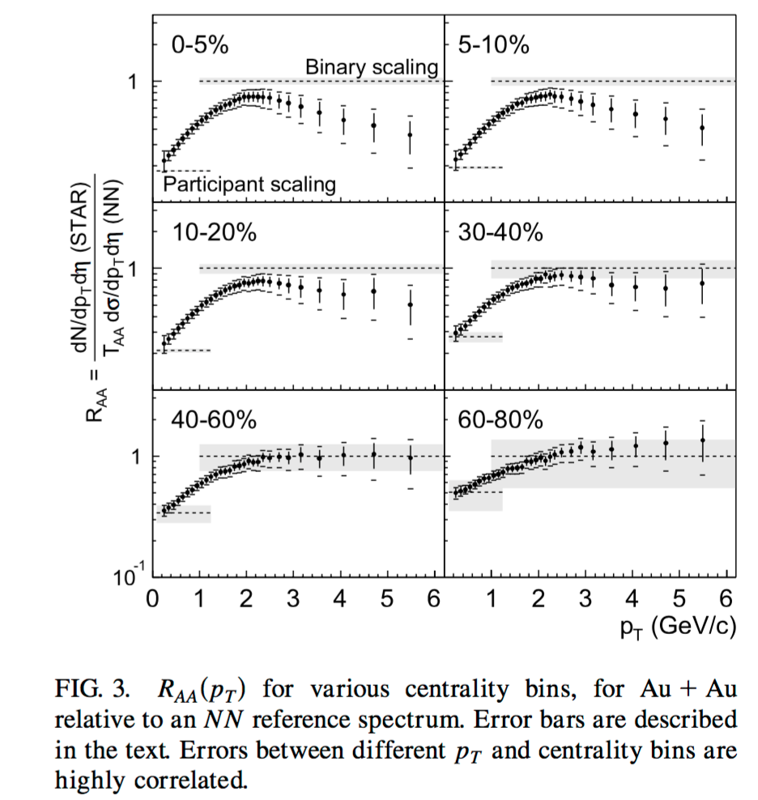
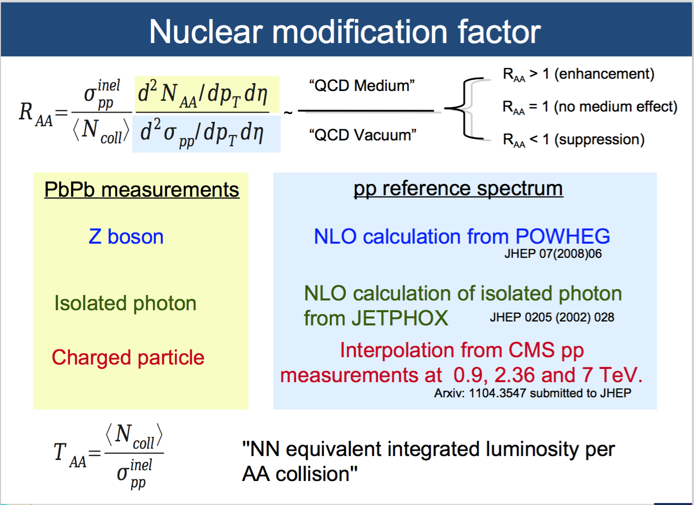

# Di-hadron

Created on 30th March 2017, should be updated daily.

In the initial stage of heavy-ion collisions, hard scatterings between partons in the incoming nuclei produce high transverse momentum partons that fragment into jets of hadrons with a clear back-to-back di-jet signature.
In Au+Au collisions, hard parsons traverse the hot and dense colored medium, thus probing the medium through energy loss.
RAA:
In-medium jet energy loss was first observed at the RHIC as a suppression of hadron spectra at high pT in AuAu collisions with respect to p+p collisions. 

[Figure. 3](https://journals.aps.org/prl/abstract/10.1103/PhysRevLett.89.202301).  R_AA (pT) varies continuously as a function of centrality, and no centrality threshold for the onset of suppression is observed, More central collisions >> longer path length, denser medium lead to more suppression
This phenomenon indicates substantial energy loss of the final state partons or their hadronic fragments in the medium generated by high energy nuclear collisions

the interpretation of R_AA from a slide of CMS:

Jet-like definition:
the jet like structure of hadron production at high pT was confirmed by measurements of the azimuthal angle difference \Delta\phi distributions of associated particles in a certain range of pT with respect to a trigger hadron at a higher pT.

The details of my di-hadron calculation:
DCA cut >> a distance of closet approach to the event vertex of less than 2 centimeters  to reduce the contribution from secondary particles.
mixed event >> the TPC sectors boundaries will introduce a dependence of the pair acceptance on angle difference \Delta\phi. this can be reduced by mixed events calculation.

